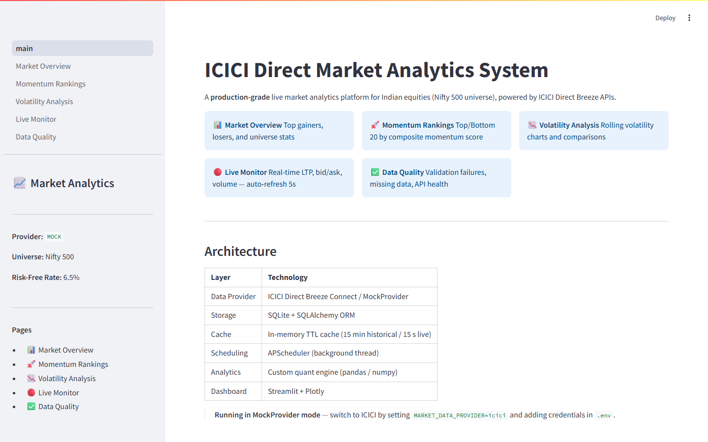
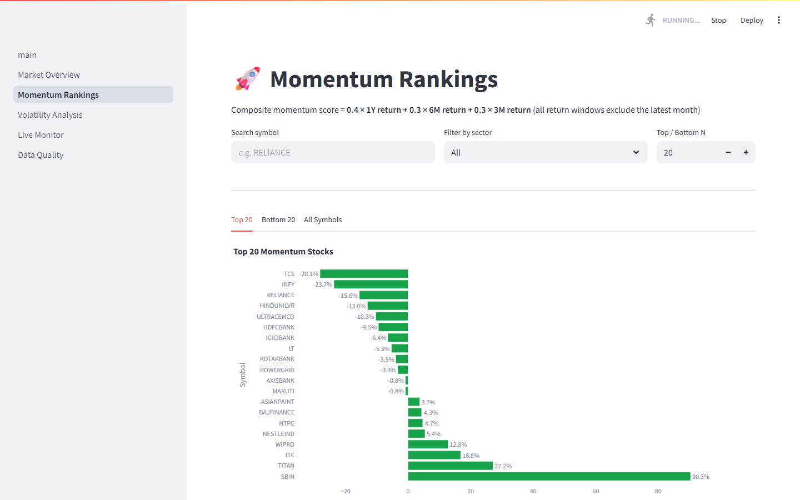
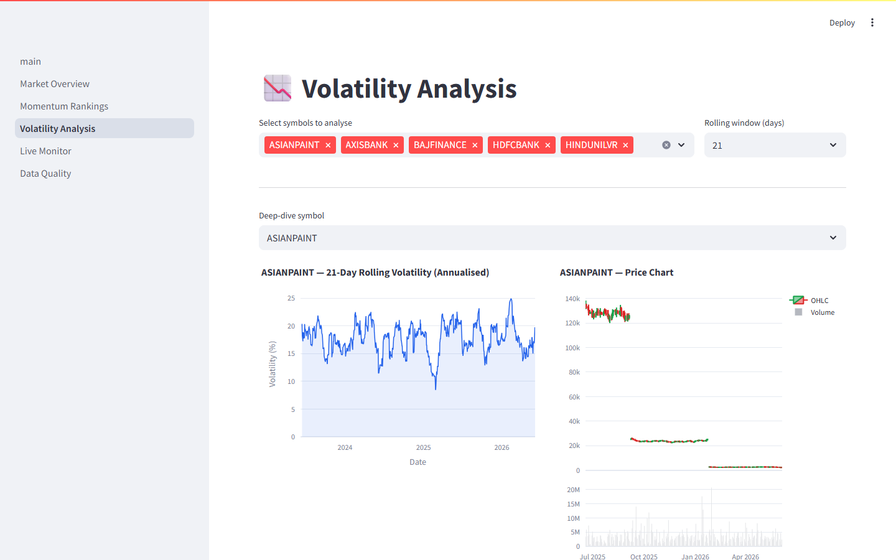

# ICICI Market Analytics System

A production-grade live market analytics platform for Indian equities (Nifty 500 universe),
built on **ICICI Direct Breeze Connect APIs** with a fully functional **offline mode** powered
by a synthetic data provider.

## Dashboard Preview

| Market Overview | Momentum Rankings | Volatility Analysis |
|---|---|---|
|  |  |  |

---

## Architecture

```
┌─────────────────────────────────────────────────────────────────┐
│                          Dashboard (Streamlit)                   │
│   Market Overview │ Momentum Rankings │ Volatility │ Live │ DQ  │
└────────────────────────────────┬────────────────────────────────┘
                                 │ reads
┌────────────────────────────────▼────────────────────────────────┐
│                         SQLite Database                          │
│   prices │ metrics │ live_quotes │ rankings │ validation_reports │
└──────┬───────────────────────────┬─────────────────────────────-┘
       │ persists                  │ persists
┌──────▼──────┐         ┌──────────▼──────────┐
│  DataFetcher│         │    MetricsEngine     │
│  + Cache    │         │  returns/vol/momentum│
└──────┬──────┘         └─────────────────────┘
       │
┌──────▼──────────────────────────────────────┐
│          BaseMarketDataProvider              │
│  ┌─────────────────┐  ┌───────────────────┐ │
│  │ ICICIDirectProv.│  │   MockProvider    │ │
│  │ (Breeze Connect)│  │   (GBM synthetic) │ │
│  └─────────────────┘  └───────────────────┘ │
└─────────────────────────────────────────────┘
```

### Layer responsibilities

| Layer | Component | Responsibility |
|---|---|---|
| Provider | `BaseMarketDataProvider` | Interface contract — all analytics depends only on this |
| Provider | `ICICIDirectProvider` | Production ICICI Breeze Connect integration |
| Provider | `MockProvider` | Deterministic GBM synthetic data for offline use |
| Data | `DataFetcher` | Cache-first fetching, incremental updates, retry |
| Data | `DataProcessor` | Cleaning, gap-fill, corporate action adjustment |
| Data | `DataValidator` | 7 data quality checks, JSON report generation |
| Storage | `Repository` | SQLAlchemy ORM, upsert semantics, typed queries |
| Cache | `CacheManager` | Thread-safe TTL cache (15 min hist / 15 s live) |
| Analytics | `MetricsEngine` | Returns, vol, momentum, Sharpe, drawdown |
| Schedule | `MarketScheduler` | APScheduler jobs (hist/live/metrics/rankings) |
| Dashboard | Streamlit pages | 5 pages with Plotly charts and auto-refresh |

---

## Analytics Formulas

| Metric | Formula |
|---|---|
| 1Y Return | `price(t-21) / price(t-252) - 1` |
| 6M Return | `price(t-21) / price(t-126) - 1` |
| 3M Return | `price(t-21) / price(t-63) - 1` |
| Momentum Score | `0.4 × 1Y + 0.3 × 6M + 0.3 × 3M` |
| Ann. Volatility | `std(daily_returns) × √252` |
| Sharpe Ratio | `(mean_excess_return / std) × √252` |
| Max Drawdown | `min((price - rolling_peak) / rolling_peak)` |

Return windows **exclude the latest month** (21 trading days) to avoid the well-documented
short-term reversal bias in cross-sectional momentum strategies.

---

## Setup

### Prerequisites
- Python 3.11+
- pip

### Install dependencies

```bash
pip install -r requirements.txt
```

### Configure environment

```bash
cp .env.example .env
# Edit .env — for offline mode, no changes needed
```

### Run (MockProvider — no credentials required)

```bash
# Step 1: Populate the database (first run takes ~2 minutes for 20 symbols)
python run_pipeline.py --limit 20

# Step 2: Launch the dashboard
python run_dashboard.py
# Opens at http://localhost:8501
```

### One-command quick start

```bash
python run_dashboard.py --run-pipeline --limit 20
```

---

## Demo Mode (MockProvider)

The entire application can be evaluated **without any ICICI Direct credentials** by
running in MockProvider mode — the default when `MARKET_DATA_PROVIDER=mock` (which is
the pre-configured default in `.env.example`).

### How MockProvider works

| Property | Detail |
|---|---|
| Price simulation | Geometric Brownian Motion (GBM) per symbol |
| Determinism | SHA-256 hash of symbol name seeds the RNG — identical data on every run |
| Returns | Calibrated to Nifty 500 style: expected 1Y ~9-12%, P5/P95 ≈ -35%/+80% |
| Volatility | Annualised vol per sector: 15%-28% (Utilities → IT) |
| Corporate actions | 0-2 splits/dividends per year, generated deterministically |
| Adj_close | Continuous backward-adjusted series — splits cause raw price drops, not adj-price gaps |
| Sectors | IT, Financial Services, FMCG, Energy, Healthcare and 7 more, each with distinct mu/sigma |
| Live quotes | Simulated intraday movement from previous close; new each calendar day |

### Running without credentials (reviewer quick-start)

```bash
# 1. Clone and install
git clone <repo>
cd icici-market-analytics
pip install -r requirements.txt

# 2. (Optional) copy .env — the defaults already select MockProvider
cp .env.example .env

# 3. Populate the database with 20 Nifty 500 symbols
python run_pipeline.py --limit 20

# 4. Launch the dashboard
python run_dashboard.py
# → Opens at http://localhost:8501
```

The pipeline takes ~15 seconds for 20 symbols and writes to `data/market_data.db`.
All five dashboard pages are fully functional with synthetic data.

### Switching to ICICI Direct (production mode)

Set `MARKET_DATA_PROVIDER=icici` and provide the three ICICI credentials in `.env`
(see [Switching to ICICI Direct](#switching-to-icici-direct) below). No code changes
are required — the provider is selected purely by configuration.

---

## Environment Variables

| Variable | Alias | Default | Description |
|---|---|---|---|
| `MARKET_DATA_PROVIDER` | `DATA_PROVIDER` | `mock` | `mock` \| `icici` |
| `ICICI_APP_KEY` | `ICICI_API_KEY` | _(empty)_ | Breeze API app key |
| `ICICI_SECRET_KEY` | `ICICI_API_SECRET` | _(empty)_ | Breeze API secret key |
| `ICICI_SESSION_TOKEN` | — | _(empty)_ | Daily session token (expires midnight IST) |
| `ICICI_CLIENT_CODE` | — | _(empty)_ | ICICI Direct client code / user ID |
| `DATABASE_URL` | `sqlite:///data/market_data.db` | SQLAlchemy URL |
| `UNIVERSE_SIZE_LIMIT` | `0` | `0` = all symbols |
| `RISK_FREE_RATE` | `0.065` | Annual RFR for Sharpe |
| `LIVE_REFRESH_INTERVAL_SECONDS` | `5` | Live quote refresh cadence (seconds) |
| `METRICS_REFRESH_INTERVAL_SECONDS` | `900` | Metrics recomputation cadence (seconds) |
| `LIVE_QUOTE_BATCH_SIZE` | `50` | Symbols per live-quote scheduler tick (API rate-limit guard) |
| `LOG_LEVEL` | `INFO` | `DEBUG` \| `INFO` \| `WARNING` \| `ERROR` |

---

## Running Tests

```bash
# Full test suite with coverage
pytest

# Quick run without coverage
pytest --no-cov

# Run specific test file
pytest tests/unit/test_returns.py -v

# Run integration tests only
pytest tests/integration/ -v
```

Coverage target: **85%+** (achieved: 86%)

---

## Running with Real ICICI Direct Data

This section covers everything needed to switch from demo mode (MockProvider) to live
market data from ICICI Direct Breeze Connect APIs.

> **Full setup guide:** See [docs/ICICI_SETUP.md](docs/ICICI_SETUP.md) for account
> requirements, IP whitelisting workflow, and troubleshooting.

### Prerequisites

| Requirement | Detail |
|---|---|
| ICICI Direct account | Active trading account with NSE Cash segment enabled |
| Breeze API subscription | Activate at [api.icicidirect.com](https://api.icicidirect.com) |
| Static IP | Required for production; dynamic IP works for evaluation |

### Step-by-step

1. **Activate Breeze API** — log in to [api.icicidirect.com](https://api.icicidirect.com),
   accept the T&C, and create an app to get your API key and secret key.

2. **Whitelist your IP** — in the portal, add your server's static IP to the whitelist.
   For local development, add your current public IP (it changes with router restarts).

3. **Configure `.env`**:
   ```env
   # Both MARKET_DATA_PROVIDER and DATA_PROVIDER are accepted
   MARKET_DATA_PROVIDER=icici

   # Both ICICI_APP_KEY and ICICI_API_KEY are accepted
   ICICI_APP_KEY=your_api_key
   ICICI_SECRET_KEY=your_secret_key
   ICICI_CLIENT_CODE=your_client_code   # optional, used in diagnostics
   ```

4. **Generate a session token** (required every day — tokens expire at midnight IST):
   ```bash
   python scripts/refresh_session.py
   ```
   This prints a login URL, waits for you to paste the `apisession` token from the
   redirect URL, then writes it to `.env` automatically.

5. **Verify the connection**:
   ```bash
   python scripts/verify_icici_live.py
   ```
   All 7 checks must pass before running the full pipeline.

6. **Run the pipeline with live data**:
   ```bash
   python run_pipeline.py --limit 100    # start with 100 symbols
   python run_pipeline.py                # full Nifty 500
   ```

7. **Launch the dashboard**:
   ```bash
   python run_dashboard.py
   # Dashboard shows "🟢 ICICI — Live data" in the sidebar
   ```

### Daily workflow (after initial setup)

```bash
# Morning before market open (09:15 IST):
python scripts/refresh_session.py   # renew expired session token

# Then restart the pipeline:
python run_pipeline.py --schedule   # runs continuously, refreshing at 17:00 IST
```

### Startup validation

The application **fails fast** if `MARKET_DATA_PROVIDER=icici` is set but credentials
are missing — you get a clear error message instead of silent degradation:

```
ProviderAuthError: MARKET_DATA_PROVIDER=icici but required credentials are missing:
  - ICICI_SESSION_TOKEN

Set them in your .env file. See docs/ICICI_SETUP.md for instructions.
To run without credentials: set MARKET_DATA_PROVIDER=mock
```

### Provider banner

The sidebar shows live status:

| Provider | Banner |
|---|---|
| MockProvider | 🔵 **MOCK** — Demo mode |
| ICICI + credentials present | 🟢 **ICICI** — Live data |
| ICICI + credentials missing | 🟡 **ICICI** → using MockProvider |

---

## Docker

```bash
# Build and start (MockProvider)
docker-compose up --build

# With real ICICI credentials
MARKET_DATA_PROVIDER=icici \
ICICI_APP_KEY=xxx \
ICICI_SECRET_KEY=yyy \
ICICI_SESSION_TOKEN=zzz \
docker-compose up
```

Dashboard available at `http://localhost:8501`.

---

## Design Decisions

### 1. Dependency Injection for providers
Analytics and dashboard code depends only on `BaseMarketDataProvider`. Switching from
`MockProvider` to `ICICIDirectProvider` requires only changing one environment variable —
no code changes. This follows the Open/Closed principle.

### 2. Parquet-style local caching vs. full DB
Rather than hitting SQLite on every dashboard render, the `CacheManager` keeps recent
data in memory with configurable TTLs. Historical data is cached for 15 minutes (re-use
across page navigations); live quotes expire after 15 seconds.

### 3. Backward-adjusted prices via multiplicative factor
Corporate actions (splits, bonuses, dividends) are applied using the standard
multiplicative backward-adjustment method. The raw `close` and adjusted `adj_close` are
both stored — you can always reconstruct either. The `adj_factor` column tracks the
cumulative factor at each date.

### 4. Return period anchoring at t-21
Excluding the latest month from all return windows is the academic standard for momentum
strategies (Jegadeesh & Titman, 1993). The `t-21` anchor avoids short-term reversal bias
and is consistent with industry practice.

### 5. SQLite with WAL mode
WAL (Write-Ahead Logging) mode allows the scheduler (writer) and dashboard (reader) to
operate concurrently without blocking each other — critical for a live analytics system.

### 6. APScheduler with coalesce=True
If a scheduled job is missed (e.g. machine sleep), it runs once on wake-up instead of
stacking. `max_instances=1` prevents concurrent execution of the same job.

---

## Assumptions

1. **Indian trading calendar**: business days via `pd.bdate_range` (Mon–Fri, no holiday adjustment)
2. **Nifty 500 universe**: static snapshot; reconstitution events are not tracked
3. **Risk-free rate**: 6.5% p.a. (approximate 91-day T-bill rate as of 2024)
4. **No order placement**: read-only analytics — no trading or execution functionality
5. **Static IP**: required for ICICI Direct API production use; must be whitelisted at the portal
6. **Session token**: expires daily at midnight IST; must be refreshed before market open

---

## Future Improvements

1. **NSE holiday calendar**: integrate NSE's official holiday list to avoid treating holidays as gaps
2. **Nifty 500 reconstitution**: fetch NSE index composition history for point-in-time correct backtests
3. **WebSocket streaming**: replace polling with Breeze WebSocket for true real-time feeds
4. **PostgreSQL support**: replace SQLite with Postgres for multi-process production deployments
5. **Alerting**: email/Slack alerts when momentum score crosses threshold or volatility spikes
6. **Factor model**: extend analytics with Fama-French factors for attribution analysis
7. **Portfolio construction**: add equal-weight and momentum-weighted portfolio simulation
8. **CI/CD**: GitHub Actions workflow for test → lint → Docker build on every push
